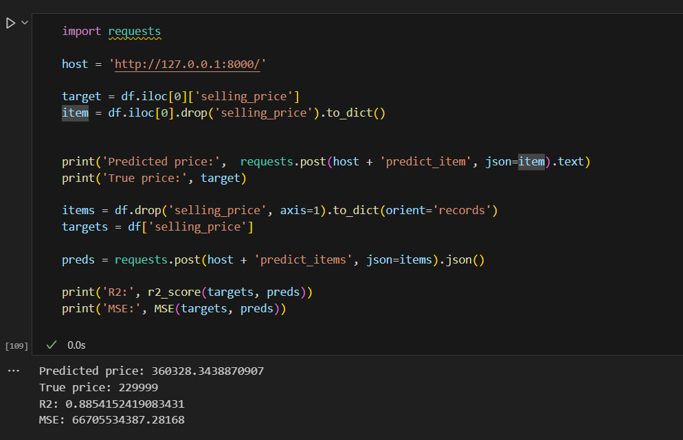

# ml-hw1-regression-with-inference

# EDA

AI_HW1_Regression_with_inference_pro.ipynb содержит EDA и эксперименты по обучению моделей для решения задачи регрессии на основе набора данных для предсказания стомости автомобилей.

Было протестировано влияние нормализации данных на качество модели. Экспериментально получено, что нормализация данных не меняет качество обыкновенной линейной регрессии, но позволяет интерпретировать веса признаков после нормализации.

Были протестированы различные методы регуляризации: L1, L2 и ElasticNet. Экспериментально получено, что L1-регуляризация позволяет уменьшить количество признаков, но качество модели не сильно меняется при выборе различных методов.

Экспериментально получено, что наличие предобработанных категориальных признаков сильно повышает качество модели. Также было показано, что добавление произведений признаков позволяет улучшить качество модели.

# API 

В файле inference.py реализовано API для предсказания целевой переменной на основе обученной модели:

POST /predict_item - предсказание целевой переменной для одного объекта

POST /predict_items - предсказание целевой переменной для нескольких объектов

# Пример запросов к API:
 
